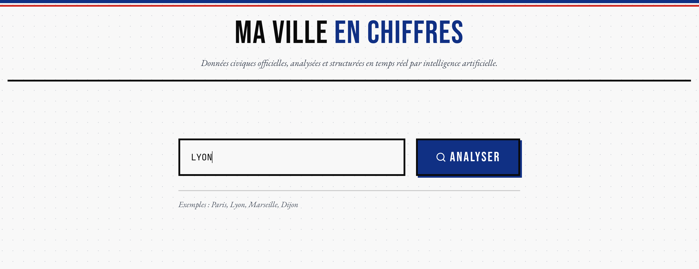
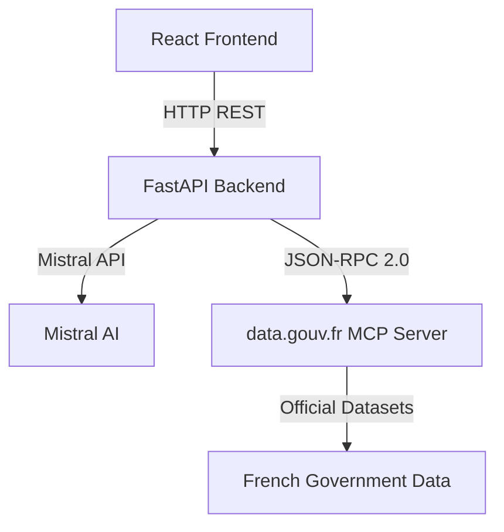

# Ma Ville en Chiffres — Civic Data Dashboard

**Built for Mistral 2026 Hackathon using Mistral Vibe CLI**

*Any French city. Real government data. Instant insights.*



[](https://www.python.org/)
[](https://fastapi.tiangolo.com/)
[](https://reactjs.org/)
[](https://www.docker.com/)
[](https://opensource.org/licenses/MIT)
[](https://mistral.ai/)

## 📋 Overview

Ma Ville en Chiffres is a civic data dashboard that lets users explore French cities through official government data. Type any French city, commune, or département name and get an auto-assembled dashboard with population trends, unemployment rates, housing prices, and more — all sourced live from [data.gouv.fr](https://www.data.gouv.fr/) via an AI agentic loop.

**Key Features:**
- ✅ Real-time data from official French government sources
- ✅ AI-powered data discovery and analysis
- ✅ Interactive visualizations (KPIs, line charts, bar charts)
- ✅ Source attribution with direct links to datasets
- ✅ Text-to-speech audio summaries via ElevenLabs
- ✅ Brutalist French civic design aesthetic
- ✅ Responsive design for desktop and tablet
- ✅ Docker-based deployment for easy setup
- ✅ Production-grade security (rate limiting, input validation)

## 🚀 Quick Start

### Prerequisites
- Docker (recommended) or Python 3.11+ and Node.js 20+
- Mistral API key (free tier available)

### 1. Clone the Repository
```bash
git clone https://github.com/Arnobgr/mistral-city-dashboard.git
cd mistral-city-dashboard
```

### 2. Set Up Environment
```bash
cp .env.example .env
# Edit .env and add your MISTRAL_API_KEY
```

### 3. Run with Docker (Recommended)
```bash
docker compose up --build
```

The application will be available at `http://localhost`

### 4. Run Manually (Development)

**Backend:**
```bash
cd backend
python -m venv venv
source venv/bin/activate  # or venv\Scripts\activate on Windows
pip install -r requirements.txt
uvicorn main:app --reload --port 8000
```

**Frontend:**
```bash
cd frontend
npm install
npm run dev
```

Frontend will be available at `http://localhost:5173`

## 🏗️ Architecture



### Key Components

**Frontend (React + TypeScript + Vite):**
- Search interface with real-time validation
- Loading states with progress indicators
- Responsive dashboard grid
- Recharts-powered visualizations
- Source attribution and links

**Backend (FastAPI + Python):**
- Agentic loop with Mistral function calling
- MCP client for data.gouv.fr integration
- Concurrent tool execution
- In-memory caching for performance
- Comprehensive error handling

**Data Sources:**
- Primary: [data.gouv.fr MCP Server](https://mcp.data.gouv.fr/mcp)
- Datasets: Population, unemployment, housing, economic indicators
- Protocol: JSON-RPC 2.0 over HTTP

## 🔧 Configuration

### Environment Variables

```env
# Required
MISTRAL_API_KEY=your_mistral_api_key_here
MCP_BASE_URL=https://mcp.data.gouv.fr/mcp

# Optional (with defaults)
MISTRAL_MODEL=mistral-large-latest
MAX_AGENT_ITERATIONS=15
CACHE_TTL_SECONDS=300
MAX_CACHE_SIZE=50

# ElevenLabs TTS (optional)
ELEVENLABS_API_KEY=your_elevenlabs_api_key_here
ELEVENLABS_VOICE_ID=21m00Tcm4TlvDq8ikWAM  # French female voice

# Security / Rate Limiting
RATE_LIMIT_DASHBOARD=20/minute
RATE_LIMIT_TTS=30/minute
```

### Development Configuration

For frontend development, the Vite proxy automatically forwards `/api` requests to the backend. No CORS configuration needed.

## 📦 Technology Stack

### Frontend
- **Framework:** React + TypeScript
- **Build Tool:** Vite
- **UI Library:** Recharts (charts)
- **Styling:** Tailwind CSS + Brutalist design
- **Linting:** ESLint + TypeScript ESLint

### Backend
- **Framework:** FastAPI
- **ASGI Server:** Uvicorn
- **AI Integration:** Mistral AI Python SDK
- **HTTP Client:** HTTPX (async)
- **Data Validation:** Pydantic v2
- **Caching:** In-memory LRU cache
- **Rate Limiting:** slowapi
- **TTS:** ElevenLabs API

### Infrastructure
- **Containerization:** Docker + Docker Compose
- **Web Server:** Nginx (production)
- **Reverse Proxy:** Nginx with 120s timeout

## 🎯 Features

### AI-Powered Data Discovery
The application uses Mistral's function calling to:
1. Search data.gouv.fr for relevant datasets
2. Identify appropriate resources (CSV files preferred)
3. Query and extract specific data points
4. Structure results into a coherent dashboard

### Real-Time Visualizations
- **KPI Cards:** Key metrics with deltas and source links
- **Line Charts:** Historical trends with tooltips
- **Bar Charts:** Comparisons and distributions
- **Responsive Grid:** Adapts to screen size
- **Audio Playback:** ElevenLabs TTS for city summaries

### Security Features
- **Rate Limiting:** 20 requests/minute for dashboard, 30/minute for TTS
- **Input Validation:** Max length enforcement (city: 200 chars, TTS: 5000 chars)
- **HTTPS Enforcement:** All source URLs must be HTTPS (XSS prevention)
- **Error Handling:** Generic error messages to prevent information leakage
- **Validation Tests:** Comprehensive test coverage for security constraints

### Performance Optimization
- **In-Memory Caching:** Dashboard results cached for 5 minutes
- **Concurrent Execution:** Multiple data queries in parallel
- **Efficient Parsing:** Robust JSON handling with fallback mechanisms

## 📊 Example Queries

Try these French cities:
- `Lyon` - Major metropolitan area
- `Marseille` - Coastal city with diverse data
- `Seine-Saint-Denis` - Department-level analysis
- `Dijon` - Medium-sized city example
- `Paris` - Capital city comprehensive data

**TTS Feature:** Click "Écouter le résumé" button on any dashboard to hear the city summary read aloud in French via ElevenLabs.

## 🧪 Testing

### Running Tests
```bash
cd backend
python -m pytest -v
```

### Test Coverage
- ✅ Agentic loop behavior
- ✅ MCP client integration
- ✅ Error handling scenarios
- ✅ Cache functionality
- ✅ API endpoint validation
- ✅ Security validations (input length, URL validation)
- ✅ Rate limiting behavior
- ✅ TTS endpoint functionality

## 📚 Data Sources

### Primary Data Provider
**data.gouv.fr MCP Server**
- **Endpoint:** `https://mcp.data.gouv.fr/mcp`
- **Protocol:** JSON-RPC 2.0
- **Tools Used:**
  - `search_datasets` - Find relevant datasets
  - `get_dataset_info` - Get dataset metadata
  - `list_dataset_resources` - List available resources
  - `query_resource_data` - Query tabular data
  - `download_and_parse_resource` - Download full resources

### Official French Government Data
All data comes from certified French government sources published on [data.gouv.fr](https://www.data.gouv.fr/), including:
- INSEE (National Institute of Statistics)
- Ministry of Ecology and Sustainable Development
- Ministry of Housing
- Local government agencies

## 🤖 AI Integration

### Mistral AI Features Used
- **Function Calling:** Structured tool execution
- **Agentic Loop:** Multi-step reasoning and tool use
- **JSON Output:** Structured data formatting
- **Parallel Tool Execution:** Concurrent data fetching

### Model Configuration
- **Model:** `mistral-large-latest`
- **Temperature:** Default (balanced creativity/precision)
- **Max Tokens:** Auto-managed by agent loop
- **Tool Choice:** Auto (model decides when to use tools)

## 🚀 Deployment

### Production Deployment
```bash
docker compose up --build -d
```

### Updating
```bash
git pull origin main
docker compose down
docker compose up --build -d
```

### Monitoring
- **Logs:** `docker compose logs -f`
- **Health Check:** `GET /api/health`
- **Performance:** Monitor `duration_seconds` in API responses

## 📝 License

This project is open-source and available under the MIT License. See [LICENSE](LICENSE) for details.

## 🤝 Contributing

Contributions are welcome! Please follow these guidelines:

1. **Fork the repository**
2. **Create a feature branch:** `git checkout -b feature/your-feature`
3. **Commit changes:** `git commit -m 'Add some feature'`
4. **Push to branch:** `git push origin feature/your-feature`
5. **Open a Pull Request**

### Development Setup
```bash
# Backend
git clone https://github.com/Arnobgr/mistral-city-dashboard.git
cd mistral-city-dashboard/backend
python -m venv venv
source venv/bin/activate
pip install -r requirements.txt -r requirements-dev.txt

# Frontend
cd ../frontend
npm install
npm run dev
```

## 🏆 Hackathon Information

**Event:** Mistral 2026 Hackathon  
**Team:** Arno  
**Built With:** Mistral Vibe CLI  
**Date:** March 2026  

### Mistral Vibe CLI
This application was developed using the **Mistral Vibe CLI** - an AI-powered coding agent that:
- ✅ Provides real-time code suggestions
- ✅ Offers architectural guidance
- ✅ Helps with debugging and optimization
- ✅ Maintains coding best practices

The Mistral Vibe CLI significantly accelerated development while ensuring code quality and adherence to software engineering best practices.


## 🎯 Future Enhancements

Potential improvements for future versions:
- **Multi-language support** for other European countries
- **Advanced filtering** by date ranges and data types
- **Data export** (CSV, PDF, images)
- **Bookmarking** favorite cities
- **Historical comparisons** between multiple cities
- **Custom TTS voices** and playback controls
- **Security dashboard** with rate limit monitoring

---

© 2026 Mistral City Dashboard. All rights reserved.

*Built with ❤️ during the Mistral AI 2026 Hackathon*